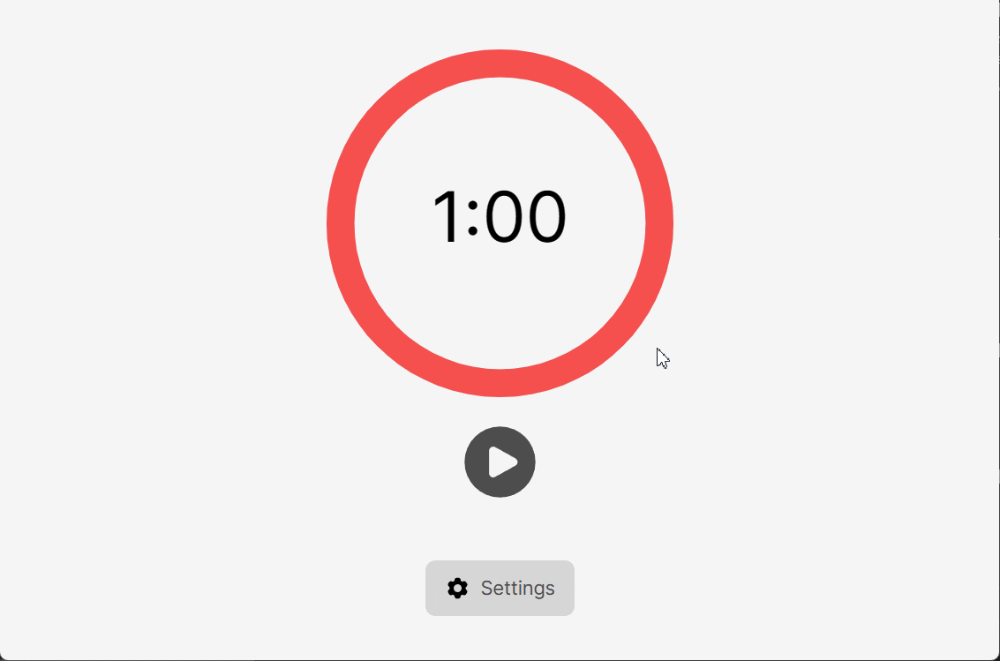

# Pomodoro Service

## 📰 Project Description:

**Objective:** Develop a Pomodoro timer with the ability to customize the theme, work and break intervals.

Functionality:

- Interval customization
- Light and dark theme options
- Sound notification
- Display push notification when a session ends

## 💻 Technologies Used:

- HTML 5 
- CSS 3 
- React 

## 🔃 Project Setup

- Clone the project to your computer from GitHub using the command: `https://github.com/vladdevjs/pomodoro-app`
- Install dependencies: `npm install`
- Run the project: `npm start`

## 🔗 Link

[Demo on Netlify](https://sparkly-croissant-efb4ee.netlify.app/)
